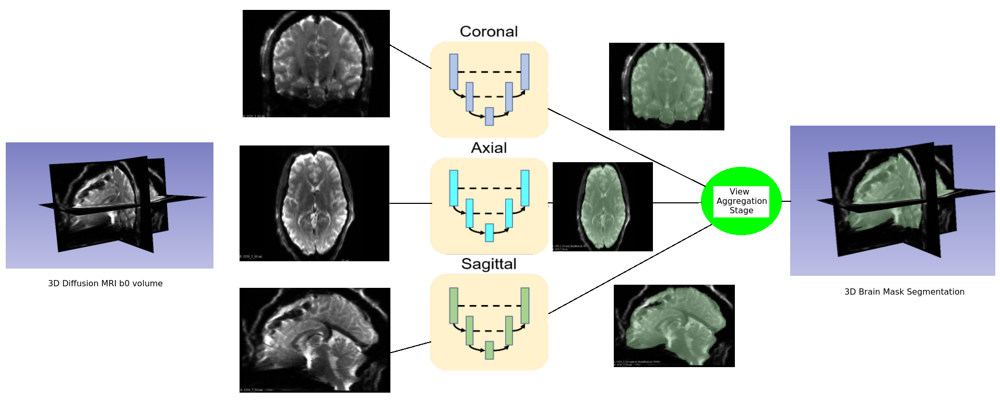

  

*CNN-Diffusion-MRIBrain-Segmentation* repository is developed by Senthil Palanivelu, Suheyla Cetin Karayumak, Tashrif Billah, Sylvain Bouix, and Yogesh Rathi, 
Brigham and Women's Hospital (Harvard Medical School).

Table of Contents
=================

   * [Segmenting diffusion brain MRI](#segmenting-diffusion-brain-mri)
   * [Citation](#citation)
   * [Dependencies](#dependencies)
   * [Installation](#installation)
      * [Python 3](#python-3)
      * [Conda environment](#conda-environment)
         * [CPU only](#cpu-only)
         * [GPU support](#gpu-support)
      * [CUDA environment](#cuda-environment)
      * [Download models](#download-models)
   * [Running the pipeline](#running-the-pipeline)
      * [Prediction](#prediction)
      * [Training](#training)
   * [Method](#method)
      * [Model Architecture](#model-architecture)
      * [Multi View Aggregation step:](#multi-view-aggregation-step)
      * [Clean up mask](#clean-up-mask)
   * [Issues](#issues)
   * [Reference](#reference)

Created by [gh-md-toc](https://github.com/ekalinin/github-markdown-toc)

# Segmenting diffusion brain MRI

A challenging problem in neuroscience is to create brain mask of an MRI. The problem becomes more challenging when 
the MRI is a diffusion MRI (dMRI) since it has less contrast between brain and non-brain regions. Researchers all over the 
world have to spent many hours drawing dMRI brain masks manually. In order to automate that process, we come up with a 
convolutional neural network (CNN) based approach for creating dMRI brain mask automatically. The CNN architecture is 
obtained from Raunak Dey's [work](https://github.com/raun1/MICCAI2018---Complementary_Segmentation_Network-Raw-Code). 
On top of that, we applied a multi-view aggregation step to obtain final brain mask.

The software is capable of both training and predicton. We also provide trained models so it can be used off the shelf.
Psychiatry NeuroImaging Laboratory has a large number of dMRI brain masks drawn by research assistants. 
The models were trained on 1,500 such brain masks. We acchieved an accuracy of 97% in properly segmenting the brain 
from a dMRI b0 volume.

# Citation

If you use this software, please cite all of the following:

* Palanivelu S, Cetin Karayumak S, Billah T, Bouix S, Rathi Y; CNN based diffusion MRI brain segmentation tool, 
https://github.com/pnlbwh/CNN-Diffusion-MRIBrain-Segmentation, 2020, DOI: 10.5281/zenodo.3665739

* Dey, Raunak, and Yi Hong. "CompNet: Complementary segmentation network for brain MRI extraction." 
International Conference on Medical Image Computing and Computer-Assisted Intervention. Springer, Cham, 2018.

* Roy, Abhijit Guha, et al. "QuickNAT: A fully convolutional network for quick and accurate segmentation of neuroanatomy." 
NeuroImage 186 (2019): 713-727.

# Dependencies

* python 3
* ANTs

# Installation

## Python 3

Download [Miniconda Python 3 bash installer](https://docs.conda.io/en/latest/miniconda.html) (32/64-bit based on your environment):
    
    sh Miniconda3-latest-Linux-x86_64.sh -b # -b flag is for license agreement

Activate the conda environment:

    source ~/miniconda3/bin/activate # should introduce '(base)' in front of each line

The software is written intelligently to work with or without GPU support. Two *yml* environment files 
are provided to facilitate creation of `dmri_seg` conda environment.
   
## Conda environment
   
### CPU only

> conda env create -f environment_cpu.yml

### GPU support

> conda env create -f environment_gpu.yml
    
    ### Install prerequisites for running the pipeline

    
Finally, activate the conda environment using:

    conda activate dmri_seg
    

## CUDA environment

When you have GPU support, provided that you used `environment_gpu.yml` for creating conda environment, 
you should set environment variables in order to run and write CUDA enabled programs. 
The NVIDIA graphics driver and CUDA compilier are already installed on machines that support CUDA. 

If you use bash, add the following lines to the bottom of your `~/.bashrc` file:

    # add cuda tools to command path
    export PATH=/usr/local/cuda/bin:${PATH}

    # add the CUDA binary and library directory to your LD_LIBRARY_PATH
    export LD_LIBRARY_PATH=$LD_LIBRARY_PATH:/usr/local/cuda-9.0/lib64
  
Open a new terminal for the changes to take effect.

## Download models

Download model architecture, weights and IIT mean b0 template from https://github.com/pnlbwh/CNN-Diffusion-MRIBrain-Segmentation/releases 
as follows:

    cd CNN-Diffusion-MRIBrain-Segmentation
    wget https://github.com/pnlbwh/Harmonization-Python/releases/download/v0.1/model_folder.tar.gz
    tar -xzvf model_folder.tar.gz

They will be extracted to `CNN-Diffusion-MRIBrain-Segmentation/model_folder` directory.

# Running the pipeline

## Prediction

Prediction refers to creation of masks based on pre-trained model. This is the common use of this software.
    
    dwi_masking.py -i cases.txt -f model_folder
    dwi_masking.py -i cases.txt -f model_folder -nproc 16
    
* `cases.txt` should contain the full path to the diffusion volumes

* Each created mask is saved in directory its diffusion volume with name `dwib0_{PREFIX}-multi_BrainMask.nii.gz`

## Training

However, you can train a model on your own data using this software.
**TBD**

# Method

## Model Architecture

The code is written by Raunak Dey available at https://github.com/raun1/MICCAI2018---Complementary_Segmentation_Network-Raw-Code. 
In summary, his proposed architecture is designed in the framework of encoder-decoder networks and have three pathways.

* 1) Segmentation Branch - learns what is the brain tissue and to generate a brain mask 

* 2) Complementary Branch - learns what is outside of the brain and to help the other
branch generate brain mask

* 3) Reconstruction Branch - It provides direct feedback to the segmentation and
complementary branche and expects reasonable predictions from them as input to reconstruct the original input image.

## Multi View Aggregation step:

The approach is to train three separate networks for three principal axes ( Sagittal, Coronal and axial ) and 
to perform multi-view aggregation step that combines segmentations from models trained on 2D slices along three principal axes: 
coronal, sagittal and axial. The final segmentation is obtained by combining the probability maps from all three segmentation.

See **TBD multi view** for details

## Clean up mask

The aggregated mask is cleaned up using a [Python translated version](../src/maskfilter) of [maskfilter from mrtrix](https://mrtrix.readthedocs.io/en/latest/reference/commands/maskfilter.html). 
In brief, there remain islands of non brain region in the aggregated mask. The above filter applies a series of morphological 
operation i.e. erosion and dilation to clean up the mask.

# Issues

If you experience any issue with using this software, please open an issue [here](https://github.com/pnlbwh/CNN-Diffusion-MRIBrain-Segmentation/issues).
We shall get back to you as soon as we can.

# Reference

* Dey, Raunak, and Yi Hong. "CompNet: Complementary segmentation network for brain MRI extraction." 
International Conference on Medical Image Computing and Computer-Assisted Intervention. Springer, Cham, 2018.

* Roy, Abhijit Guha, et al. "QuickNAT: A fully convolutional network for quick and accurate segmentation of neuroanatomy." 
NeuroImage 186 (2019): 713-727.

* Billah, Tashrif; Bouix; Sylvain; Rathi, Yogesh; Various MRI Conversion Tools, https://github.com/pnlbwh/conversion, 2019, 
DOI: 10.5281/zenodo.2584003

* **TBD multi view**

